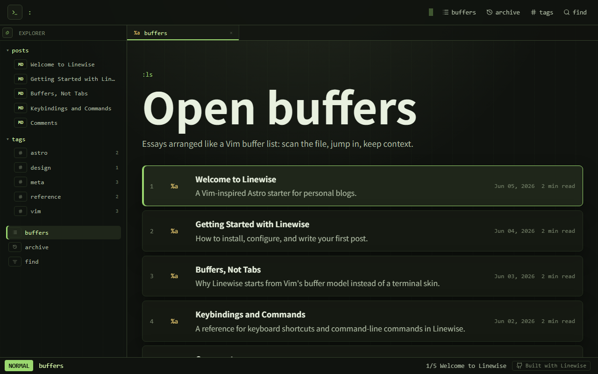

# Linewise

[](https://astro.build)
[](LICENSE) [](https://linewise.tabsp.com)



Linewise is a Vim-inspired Astro starter for personal blogs. It is not a generic terminal theme: posts behave like buffers, search borrows from quickfix, and the interface uses Vim as an interaction model without sacrificing reading comfort.

**Preview:** [linewise.tabsp.com](https://linewise.tabsp.com)

## Features

- Static Astro output
- Markdown and MDX posts
- Typed content collections
- RSS, sitemap, canonical URLs, and Open Graph metadata
- Tags, archive, client-side search, and a quickfix-style search page
- giscus comments powered by GitHub Discussions (opt-in)
- Vim-like command palette, search palette, bufferline, file explorer, and statusline
- Keyboard motions for list navigation and reading
- Mobile file explorer drawer and horizontally scrollable buffer tabs

## Design Direction

- Posts are buffers.
- The homepage behaves like `:ls`.
- Archive and tag pages borrow from quickfix and location lists.
- Search is a client-side quickfix filter.
- The statusline and command line provide orientation without getting in the way.
- Reading comfort wins over novelty.

For a deeper dive into the design, read [Buffers, Not Tabs](https://linewise.tabsp.com/posts/buffers-not-tabs/).

## Upgrading

Linewise includes a built-in upgrade workflow. See the [Upgrading Linewise](https://linewise.tabsp.com/posts/upgrading-linewise/) guide for how to pull upstream framework updates without losing your content or config.

## Getting Started

### 1. Create your project

```sh
pnpm create astro@latest --template tabsp/linewise
```

This downloads the latest template, installs dependencies, and gives you a clean project. Then start the dev server:

```sh
cd your-project
pnpm dev
```

### 2. Configure your site

Edit `linewise.config.ts`:

```ts
import { defineLinewiseConfig } from "./src/types/config";

export default defineLinewiseConfig({
  site: {
    url: "https://your-domain.com",
    title: "Your Blog",
    description: "Your personal blog.",
    author: "Your Name",
    lang: "en",
    locale: "en",
  },
});
```

Every field except `url`, `title`, `description`, and `author` has a sensible default.

### 3. Write your posts

Replace the example posts in `src/content/blog/`. Each Markdown or MDX file needs frontmatter:

```md
---
title: "Your Title"
description: "A short description."
pubDate: 2026-01-01
tags: ["tag1", "tag2"]
---
```

See the [Getting Started](https://linewise.tabsp.com/posts/getting-started/) guide for the full schema.

### 4. Replace branding

Replace `public/favicon.svg` and `public/og.svg` with your own artwork.

### 5. Deploy

Deploy with one click:

[](https://vercel.com/new/clone?repository-url=https%3A%2F%2Fgithub.com%2Ftabsp%2Flinewise)
[](https://app.netlify.com/start/deploy?repository=https://github.com/tabsp/linewise)

Any static host that runs Astro also works. See the [Getting Started](https://linewise.tabsp.com/posts/getting-started/) guide for more.

## Comments

Linewise includes opt-in [giscus](https://giscus.app) comments backed by GitHub Discussions, with a custom theme that matches the Linewise palette.

To enable comments, add this to your `linewise.config.ts`:

```ts
comments: {
  provider: "giscus",
  giscus: {
    repo: "your-username/your-repo",
    repoId: "R_kgDO...",
    category: "Announcements",
    categoryId: "DIC_kwDO...",
  },
},
```

See the [Comments](https://linewise.tabsp.com/posts/comments/) guide for setup instructions.

## Keybindings and Commands

Linewise has Vim-style keyboard navigation and a command palette. See the [Keybindings and Commands](https://linewise.tabsp.com/posts/keybindings-and-commands/) post for the full reference.

## Development

```sh
pnpm install
pnpm dev
pnpm build
```

CI uses pnpm as well (see `.github/workflows/ci.yml`).

## Project Layout

```text
├── linewise.config.ts          User-editable site config
├── src/
│   ├── content/
│   │   └── blog/               Markdown and MDX posts
│   ├── content.config.ts       Blog frontmatter schema
│   ├── config.ts               Resolved site configuration
│   ├── types/                  TypeScript type definitions
│   ├── components/             UI components
│   ├── pages/                  Routes
│   ├── scripts/
│   │   ├── linewise.ts         Client-side entry point
│   │   └── modules/            Domain modules
│   └── styles/
│       └── global.css          Theme tokens and layout
└── public/                     Static assets (favicon, OG image)
```

## Status

Linewise currently ships as a starter/template, not an npm theme package. It includes static output, Markdown/MDX, typed content collections, RSS, sitemap, tags, archive, search, SEO metadata, and code highlighting.

**Preview:** [linewise.tabsp.com](https://linewise.tabsp.com)

## License

MIT
