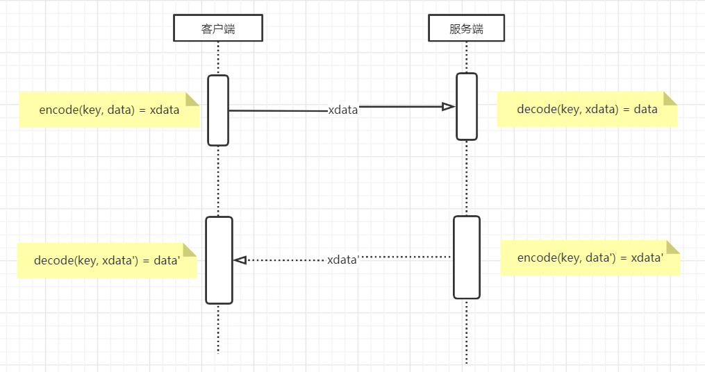
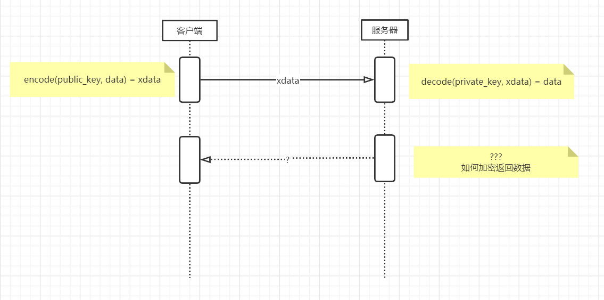
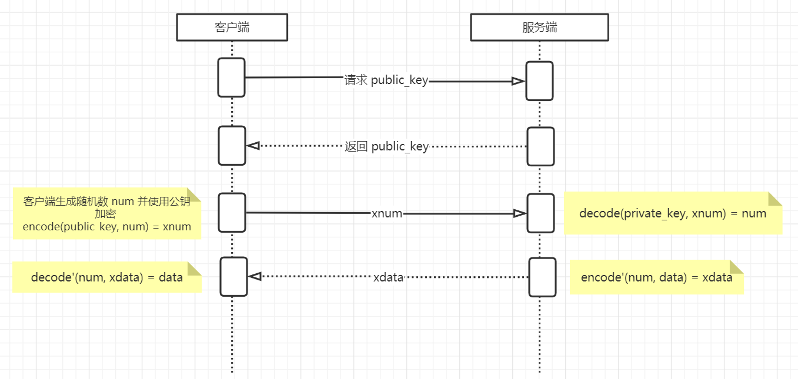
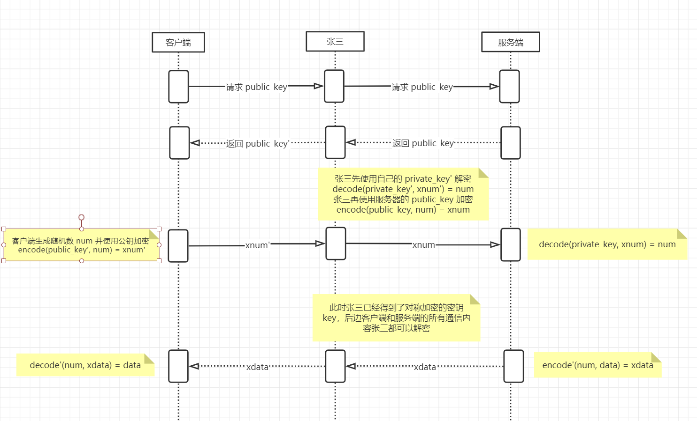
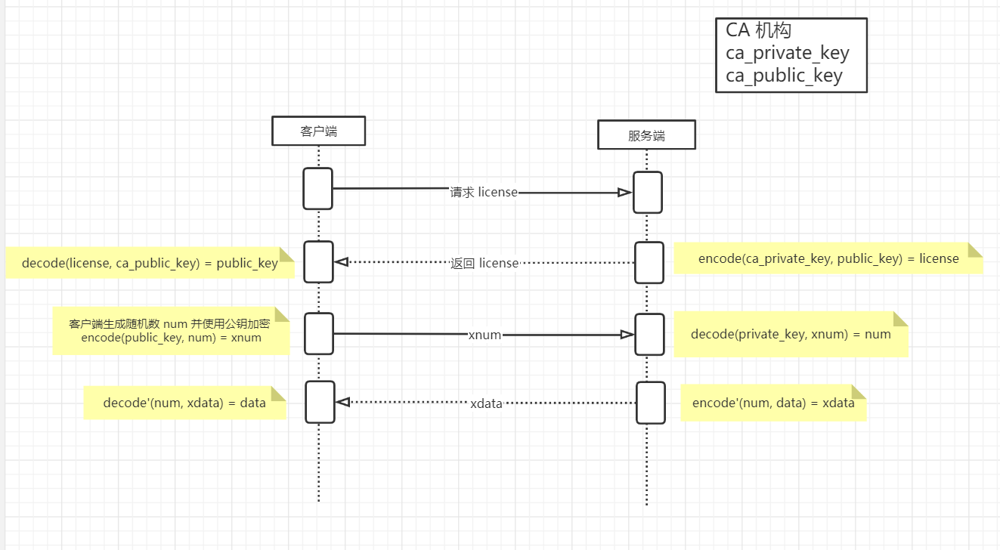

## 为什么要加密？

如果所有的信息都在互联网上进行明文传输，那么就意味着所有信息都可以被“黑客”随意获取或篡改。

## 如何加密？

### 对称加密

设：加密函数为 encode，解密函数为 decode，秘钥为 key，要传输的数据为 data，加密后的数据为 x_data

可得：

1. encode(key, data) = x_data
2. decode(key, x_data) = data

即：加密和解密的过程都是通过同一个秘钥 key 完成的，所以**对称加密**的“**对称”**指的是加密和解密用的是同一个秘钥 key。

下面模拟一次请求的过程：

客户端发送消息时：使用 encode(key, data) = x_data 得到加密后的数据 x_data 并传输给服务端；

服务端接收消息时：接收到加密后的数据 x_data 后使用 decode(key, x_data) = data 解密后得到原始数据 data。

服务器返回消息和客户端接收消息同样的道理不再赘述。

但是问题来了：如何制定秘钥 key 呢？

1. 所有客户端都使用同一个秘钥 key。

    那就和明文没有任何区别了，因为任何人（包括“黑客”）都可以通过成为客户端来获取秘钥。

2. 每个客户端制定一个秘钥 key。

    i. 首先如何安全的分发定制好的秘钥 key ？这本身也是一个安全通信的问题，一种解决方案是提前与客户端约定好密钥 key，但是这样就会带来下面的第二个问题；

    ii. 如果服务端需要和 n 个客户端通信就需要维护 n 个秘钥，当 n 非常大时维护成本也会变得非常高。

**所以使用对称加密无法保证整个传输过程的安全性。**

### 非对称加密

设：加密函数为 encode，解密函数为 decode，公钥为 public_key，私钥为 private_key，要传输的数据为 data，使用公钥加密后的数据为 x_data，使用私钥加密后的数据为 x_data'

可得：

1. encode(public_key, data) = x_data
2. decode(private_key, x_data) = data
3. encode(private_key, data) = x_data'
4. decode(public_key, x_data') = data

即：通过公钥 public_key 加密后的数据可以使用 私钥 private_key 进行解密，反之通过私钥 private_key 加密的数据也可以通过公钥 public_key 进行解密。所以**非对称加密**的“**非对称**”指的是加密和解密的秘钥需要分别使用公钥 public_key，私钥 private_key。

public_key 是公开的（对于所有人都是如此），而 private_key 必须保密，只有服务端知道。

下面也模拟一次请求：

1. 客户端发送消息时：使用 f1(public_key, data) = x_data 得到加密后的数据 x_data 并传输给服务端；

2. 服务端接收数据时：接收到加密后的数据 x_data 后使用 f2(private_key, x_data) = data 解密后得到原始数据 data；

问题又来了：服务端返回的数据该如何加密？

1. 使用公钥加密？

    上边提到私钥只有服务端知道，客户端并没有私钥，所以无法解密数据*。*

2. 那使用私钥加密呢？

    上边提到使用私钥加密后的数据可以通过公钥进行解密，同时公钥又是对所有人公开的，那就又和明文没有任何区别了。

**所以使用非对称加密也无法保证整个传输过程的安全性。**

## HTTPS 如何加密

既然对称加密和非对称加密都无法保证整个传输过程的安全性，那 HTTPS 是如何保证安全性的呢？

首先我们总结一下需要解决的问题：

1. 对称加密无法保证密钥分发的安全性；
2. 非对称加密无法保证服务端返回数据的安全性；
3. 非对称加密的计算量相对于对称加密来说非常巨大，所以如果整个通信过程中都使用非对称加密那么加解密的过程就会消耗大量的服务器资源。

下面我们将结合对称加密和非对称加密模拟请求的过程：

1. 客户端向服务端请求公钥；
2. 服务端返回公钥；
3. 客户端生成随机数 num 并使用公钥加密后发送给服务端；
4. 服务端接收到请求后使用私钥解密得到随机数 num ；
5. 接下来使用的通信都使用对称加密并将 num 作为加密的密钥。

### 中间人攻击

如果在客户端和服务器之间通信的一开始就存在一个中间人张三，他首先拦截客户端请求，再将自己伪装成客户端向服务端发起请求；当服务端返回数据时，张三也首先拦截到返回数据，再伪装为服务端将数据返回给客户端。

### CA 机构

之所以可以进行中间人攻击是因为客户端无法校验公钥的正确性，比如当客户端请求到公钥后如何证明此公钥就是原本预想的那台服务器发行的公钥，而不是被张三所替换后的公钥，为了解决这个问题我们就需要引入 CA 机构加入到通信过程中。

问题：

ca_public_key 是如何分发到客户端的？一旦通过网络传输不还是会存在中间人问题？

所以 ca_public_key 不通过网络分发，而是直接安装在操作系统中，随操作系统或浏览器分发。

## HTTPS 对话密钥协商过程（简化版本）

1. 客户端向服务器发起 Client Hello 请求

    i. 客户端支持的 TLS 版本号

    ii. 随机数 num1

    iii. 客户端支持的加密算法

2. 服务端收到请求，响应 Server Hello

    i. 确认要使用的 TLS 版本号

    ii. 随机数 num2

    iii. 确认要使用的加密算法

    iiii. 服务器证书 license

3. 客户端接收服务端响应，校验 license 有效性

4. 客户端继续发起请求

    i. 随机数 num3，使用服务器公钥加密

    ii. num1、num2 摘要信息，hash(num1, num2)

5. 服务端收到请求，校验摘要信息，同时使用 num1、num2、num3 生成对话密钥

6. 服务端返回数据

    i. hash(num1、num2、num3)

7. 客户端接收请求并校验摘要信息，同时使用 num1、num2、num3 生成对话密钥

### 注意

1. 协商过程是明文进行的
2. 对话密钥不在网络上进行传输，而是由服务端和客户端各自计算出来的

（完）